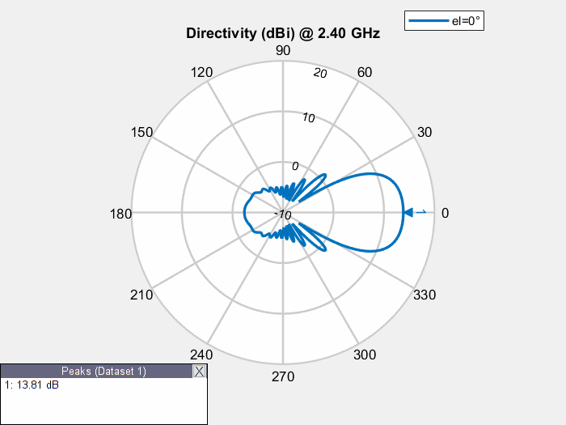

# PhasedArrayAntennas
 Simulation in Matlab of a Phased Array Antenna, using the Antenna Toolbox

In root folder there's a pdf file which briefly explain the work and the theory of phased array systems
(sadly, I wrote it in italian at the time. Sorry for that).

